<div align="center">


# **Substrate**

### **Infrastructure for Human Knowledge & Progress**

[](https://github.com/danielmiessler/Substrate/commits/main)
[](https://opensource.org/licenses/MIT)
[](https://github.com/danielmiessler/Substrate/stargazers)
[](https://www.typescriptlang.org/)
[](https://bun.sh)

<p align="center">
  <a href="#-what-is-substrate">What Is It</a> •
  <a href="#-data--evidence">Data</a> •
  <a href="#-quick-start">Quick Start</a> •
  <a href="#-documentation">Docs</a> •
  <a href="#-contribute">Contribute</a> •
  <a href="#-roadmap">Roadmap</a>
</p>

</div>

---

## 🎯 What Is Substrate?

<div align="center">
<a href="https://www.youtube.com/watch?v=ky7ejowc_qY">
  
</a>

**[→ Watch Introduction Video](https://www.youtube.com/watch?v=ky7ejowc_qY)** • **[→ Read Blog Post](https://danielmiessler.com/blog/how-my-projects-fit-together)**
</div>

---

### **A Shared Foundation for Human Progress**

Think of **substrate** as the base layer—the common ground where we can all work together to understand problems and drive solutions forward. Instead of fragmented discussions and reinventing the wheel, Substrate gives us **one place** to:

- **Document problems** → What's actually broken, with evidence
- **Track solutions** → What works, what doesn't, with results
- **Connect progress** → Link people, organizations, and projects actually moving things forward
- **Build on each other** → Arguments and ideas that build on shared evidence
- **Measure outcomes** → Did it work? What actually changed?

**The Purpose: Accelerate Human Progress**

We can't solve problems we don't understand. We can't build on solutions we can't find. Substrate provides:

- 🎯 **Shared understanding** → One place to understand what's wrong and what works
- 🚀 **Faster progress** → Build on existing knowledge instead of starting over
- 📊 **Evidence-based action** → Ground decisions in authoritative data, not opinions
- 🔗 **Connected knowledge** → See how problems, solutions, people, and data interconnect
- 🌍 **Collective intelligence** → Human insight + AI analysis working together toward progress

**An open-source framework connecting 17+ knowledge components:**

```mermaid
graph TB
    subgraph "🌍 The Substrate"
        A[🧩 Problems]
        B[💡 Solutions]
        C[📊 Data Sources]
        D[🗣️ Arguments]
        E[📋 Claims]
        F[👥 People]
        G[🏢 Organizations]
        H[🚀 Projects]
        I[📈 Plans]
        J[🎯 Values]
        K[💭 Ideas]
    end

    L[👤 Human Contributors] --> A
    L --> B
    L --> D
    M[🤖 AI Analysis] --> A
    M --> B
    M --> D

    A -.connects to.-> B
    B -.connects to.-> C
    D -.connects to.-> C
    E -.connects to.-> C
    F -.connects to.-> G
    G -.connects to.-> H
    H -.connects to.-> B

    A --> N[🔍 Shared Understanding]
    B --> N
    C --> N
    D --> N
```



<table>
<tr>
<td width="50%">

### 🏗️ **Structured Components**

- **Problems** - Documented challenges with evidence
- **Solutions** - Proven approaches with results
- **Arguments** - Reasoning chains with quality scores
- **Claims** - Assertions linked to evidence
- **Plans** - Actionable strategies with metrics
- **Ideas** - Frameworks and concepts
- **People & Organizations** - Who's working on what
- **Projects** - Active initiatives with outcomes

</td>
<td width="50%">

### 📊 **Authoritative Data**

- **13 Data Sources** across 100+ years
- **Library science methodology** (8 dimensions)
- **Government agencies** + verified databases
- **TypeScript automation** with Bun runtime
- **Full documentation** for every dataset
- **Free APIs** with excellent access
- **Human wellbeing indicators** beyond GDP
- **Real-time** to annual update frequencies

</td>
</tr>
</table>

---

## 🚀 What's New

> [!TIP]
> **October 2025 - Massive Data Expansion!**
>
> We just added **8 authoritative data sources** measuring human wellbeing beyond traditional economic metrics. Now track financial stress, health crises, social connection, worker agency, and environmental health.

<details>
<summary><strong>📅 Latest Updates (Click to expand)</strong></summary>

### 🔥 October 27, 2025 - Human Wellbeing Infrastructure

**5 NEW US Wellbeing Data Sources:**

| Added | Source | What It Measures |
|-------|--------|------------------|
| 🆕 | **DS-00004** FRED Economic Wellbeing | Debt stress, unemployment, inequality |
| 🆕 | **DS-00005** CDC WONDER Mortality | Overdoses, suicides, deaths of despair |
| 🆕 | **DS-00006** Census ACS Social | Living alone, commute times, isolation |
| 🆕 | **DS-00007** BLS JOLTS Labor | Worker "permission to quit" index |
| 🆕 | **DS-00008** EPA Air Quality | PM2.5, ozone, environmental health |

**Why This Matters:**
> "If we measure only GDP and unemployment, we will miss the slow-motion collapse of human thriving happening in plain sight."

These sources capture:
- 💰 **Leading indicators** - Financial stress predicts recessions
- 🎭 **Behavioral truth** - Actions reveal what surveys miss
- 🏗️ **Structural determinants** - Air quality you can't "self-care" out of
- 🚨 **Crisis detection** - County-level suffering visibility
- 🆓 **Worker agency** - Quit rate = economic freedom measure

### October 25, 2025 - Core Data Updates
- ✅ Pulitzer Prize, GDP, inflation data refreshed
- ✅ Knowledge Worker Salaries validation completed

### October 16-18, 2025 - Infrastructure
- 🏗️ Library science methodology (8-dimension evaluation)
- ⚡ TypeScript automation with auto-discovery
- 📊 Central logging and health monitoring
- 📚 Complete documentation suite

---

<details>
<summary><strong>📜 Previous Updates (Click to expand)</strong></summary>

### September 2024 - Community Growth
- ✅ Claims, Arguments, and Values frameworks
- ✅ 6+ community contributors
- ✅ 10+ merged pull requests
- ✅ TELOS integration

### August 2024 - Framework Expansion
- ✅ Extended component types (Plans, Ideas, Models)
- ✅ Improved documentation structure
- ✅ Enhanced contribution guidelines

### July 2024 - Foundation
- ✅ Single-repo structure with 17+ object types
- ✅ Core framework and documentation
- ✅ Public launch with initial datasets
- ✅ Community contribution framework

</details>

---

**[→ View Full Changelog](./UPDATES.md)**

</details>

---

## 📊 Data & Evidence

> [!NOTE]
> All data sources include **complete library science cataloging** with 8-dimension evaluation: Authority, Currency, Objectivity, Accuracy, Methodology, Coverage, Reliability, and Provenance.

> [!IMPORTANT]
> **We know data can be controversial.** That's exactly why we:
> - 📊 **Collect from multiple sources** - Cross-reference data from different authoritative providers
> - 🔍 **Provide complete transparency** - Every source fully documented with provenance, methodology, and limitations
> - 📝 **Full logging** - All data pulls logged with timestamps, source versions, and processing steps
> - 🔓 **Open source everything** - TypeScript update scripts show exactly how data is fetched and transformed
>
> You can verify, audit, and challenge our data. That's the point.

### **Core Datasets** (`Data/`)

| Dataset | Time Span | Data Points | Source | Status |
|---------|-----------|-------------|--------|--------|
| 🇺🇸 **US GDP** | 1929-2025 | 96 years + 314 quarters | FRED/BEA | ✅ Active |
| 💵 **US Inflation** | 1947-2025 | 945 months | FRED/BLS | ✅ Active |
| 🦠 **Bay Area COVID Wastewater** | 2022-2025 | 161 weeks | CDPH | ✅ Active |
| 🏆 **Pulitzer Prize Winners** | 1918-2024 | 249 winners | Wikidata | ✅ Active |
| 💼 **Knowledge Worker Salaries** | Global | Multi-region | Research | ✅ Active |

### **Wellbeing Data Sources** (`Data-Sources/`) 🆕

<details>
<summary><strong>🌍 Global Health & Development (Click to expand)</strong></summary>

| ID | Name | Coverage | Indicators | Update |
|----|------|----------|------------|--------|
| **DS-00001** | [WHO Global Health Observatory](./Data-Sources/DS-00001—WHO_Global_Health_Observatory/) | 194 countries | 2,000+ health indicators | Quarterly |
| **DS-00002** | [UN SDG Indicators](./Data-Sources/DS-00002—UN_SDG_Indicators/) | 193 countries | 231 SDG targets | Biannual |
| **DS-00003** | [World Bank Open Data](./Data-Sources/DS-00003—World_Bank_Open_Data/) | Global | Development metrics | Varies |

</details>

<details open>
<summary><strong>🇺🇸 US Human Wellbeing (October 2025)</strong></summary>

<table>
<tr>
<th width="15%">Source</th>
<th width="35%">Key Indicators</th>
<th width="30%">Why It Matters</th>
<th width="20%">Update Freq</th>
</tr>

<tr>
<td><strong>DS-00004</strong><br/><a href="./Data-Sources/DS-00004—FRED_Economic_Wellbeing/">FRED Economic</a></td>
<td>
• Debt service ratio<br/>
• Credit card delinquency<br/>
• Financial stress index<br/>
• Underemployment (U-6)<br/>
• Consumer sentiment<br/>
• GINI inequality
</td>
<td>💰 <strong>Economic Security Foundation</strong><br/>Debt >12% = stress, >14% = crisis. Leading indicator of recession.</td>
<td>Weekly to Annual</td>
</tr>

<tr>
<td><strong>DS-00005</strong><br/><a href="./Data-Sources/DS-00005—CDC_WONDER_Mortality/">CDC WONDER</a></td>
<td>
• Drug overdose deaths<br/>
• Opioid-specific deaths<br/>
• Suicide rates<br/>
• All-cause mortality
</td>
<td>🚨 <strong>Crisis Detection</strong><br/>Deaths of despair reveal community breakdown surveys miss. County-level visibility.</td>
<td>Annual (1-2yr lag)</td>
</tr>

<tr>
<td><strong>DS-00006</strong><br/><a href="./Data-Sources/DS-00006—Census_ACS_Social_Wellbeing/">Census ACS</a></td>
<td>
• Living alone (isolation)<br/>
• Commute times (time poverty)<br/>
• No internet (digital divide)<br/>
• Household demographics
</td>
<td>🤝 <strong>Social Connection</strong><br/>Structural isolation and time poverty constrain flourishing. Census tract granularity.</td>
<td>Annual</td>
</tr>

<tr>
<td><strong>DS-00007</strong><br/><a href="./Data-Sources/DS-00007—BLS_JOLTS_Labor_Market/">BLS JOLTS</a></td>
<td>
• <strong>Quit rate</strong> (worker agency)<br/>
• Job openings<br/>
• Hire rate<br/>
• Layoff/discharge rate
</td>
<td>🆓 <strong>"Permission to Quit"</strong><br/>People only quit when they have options. Measures economic freedom and dignity.</td>
<td>Monthly</td>
</tr>

<tr>
<td><strong>DS-00008</strong><br/><a href="./Data-Sources/DS-00008—EPA_Air_Quality_System/">EPA Air Quality</a></td>
<td>
• PM2.5 (particulate matter)<br/>
• Ozone (O3)<br/>
• SO2, CO, NO2<br/>
• AQI exceedances
</td>
<td>🌫️ <strong>Environmental Health</strong><br/>You can't "self-care" out of breathing toxic air. Structural wellbeing constraint.</td>
<td>Real-time</td>
</tr>

</table>

</details>

### **Composite Wellbeing Indices**

> [!TIP]
> Combine multiple data sources to create powerful wellbeing metrics:

- 💸 **Financial Stress Composite** - Debt + delinquency + evictions + stress index
- 🚨 **Crisis Alert Composite** - Overdoses + suicides + long-term unemployment
- 🤝 **Community Health Composite** - Living alone + commute + digital divide (inverted)
- 🆓 **Worker Agency Index** - Quit rate + job openings / unemployment
- 🌫️ **Environmental Health Index** - PM2.5 + ozone (inverted)

**[→ Wellbeing Implementation Guide](./Data-Sources/WELLBEING_DATA_SOURCES.md)** | **[→ Data Directory](./Data/README.md)**

---

## 🤖 Human & AI Collaboration

> **Substrate provides the pieces. You and your AI create the connections.**

<table>
<tr>
<td width="50%">

### 👤 **Humans Contribute**

- Document problems and solutions
- Add authoritative data sources
- Create arguments and claims
- Link entities explicitly
- Validate AI suggestions
- Rate quality of evidence

</td>
<td width="50%">

### 🤖 **AI Analyzes**

- Scan thousands of components
- Suggest relationships automatically
- Detect patterns across datasets
- Score argument quality
- Find contradictions
- Generate knowledge graphs

</td>
</tr>
</table>

**Everything is designed for dual consumption:**
- ✅ **Human-readable** - Markdown and CSV anyone can open
- ✅ **Machine-parseable** - Consistent formats AI can query
- ✅ **Fully documented** - Complete methodology for every dataset
- ✅ **Linked with IDs** - Unambiguous entity references

### Use Cases

<details>
<summary><strong>🔍 OSINT & Investigation</strong></summary>

- Cross-reference public records, corporate filings, government data
- Link people → organizations → transactions → policies
- Surface connections invisible in isolated databases
- Build evidence chains from claims to verifiable records
- Pattern detection for fraud, corruption, illicit networks

</details>

<details>
<summary><strong>📊 Research & Analysis</strong></summary>

- Track claims against authoritative data sources
- Evaluate argument quality based on evidence backing
- Compare solutions across different implementations
- Measure progress toward stated goals with real metrics
- Cross-correlate economic, health, social, environmental data

</details>

<details>
<summary><strong>🌐 Public Accountability</strong></summary>

- Verify political claims against documented evidence
- Track campaign promises → policy outcomes → measured results
- Link donations → voting records → policy positions
- Monitor government spending against stated objectives
- Environmental justice analysis (who breathes toxic air?)

</details>

---

## 🚀 Quick Start

### **View the Data** (No Installation Required)

All datasets are available as **CSV and Markdown files** you can browse directly:

```bash
# Clone the repository
git clone https://github.com/danielmiessler/Substrate.git
cd Substrate

# Explore core datasets
ls Data/*/

# Explore wellbeing data sources
ls Data-Sources/*/
```

### **Run the Automation** (Optional)

> [!WARNING]
> Requires [Bun](https://bun.sh) runtime. Install: `curl -fsSL https://bun.sh/install | bash`

```bash
# Install dependencies
bun install

# Update a specific dataset
cd Data/US-GDP
bun run update.ts

# Update a wellbeing source (requires API key)
export FRED_API_KEY="your_key_here"
cd Data-Sources/DS-00004—FRED_Economic_Wellbeing
bun run update.ts

# Update all datasets
bun run scripts/update-all.ts
```

### **Get API Keys** (Free)

| Data Source | Get Key | Rate Limit |
|-------------|---------|------------|
| FRED Economic | [fred.stlouisfed.org/docs/api](https://fred.stlouisfed.org/docs/api/api_key.html) | 120 req/min |
| Census ACS | [api.census.gov/data/key_signup](https://api.census.gov/data/key_signup.html) | 500 req/day |
| EPA Air Quality | Email: aqs.support@epa.gov | 10 req/min |
| BLS JOLTS | [bls.gov/developers/home](https://www.bls.gov/developers/home.htm) | 500 req/day |
| CDC WONDER | No key required | Fair use |

**[→ Complete Getting Started Guide](./GETTING_STARTED.md)** | **[→ Quick Reference](./QUICK_REFERENCE.md)**

---

## 💡 Contribute

> [!IMPORTANT]
> **Anyone can submit components.** No gatekeeping on ideas—just structured formats.

### **What You Can Add**

<table>
<tr>
<td width="33%">

**📋 Problems**
- Water quality issues
- Healthcare access gaps
- Climate change impacts

**💡 Solutions**
- Filtration systems
- Telemedicine networks
- Infrastructure adaptation

**📈 Plans**
- Political platforms
- Policy proposals
- Action roadmaps

</td>
<td width="33%">

**🗣️ Arguments**
- "This works because X, Y, Z"
- "This failed due to A, B"
- (We don't judge—community rates)

**📊 Data**
- Public records
- Research datasets
- Compiled statistics

**💭 Ideas**
- Theoretical frameworks
- Novel measurement approaches
- Conceptual models

</td>
<td width="33%">

**👥 People & Orgs**
- Researchers on problems
- Organizations implementing
- Projects with outcomes

**📏 Metrics**
- Success criteria
- Measurement frameworks
- Progress indicators

**🎯 Values**
- Guiding principles
- Evaluation criteria

</td>
</tr>
</table>

### **How to Submit**

1. **Fork the repository** on GitHub
2. **Add your component** in the appropriate directory (`Problems/`, `Solutions/`, etc.)
3. **Follow the format** in that directory's README
4. **Submit a Pull Request**

> [!NOTE]
> We're building a **web interface** to make this easier for non-technical contributors!

**[→ Contribution Guidelines](./GETTING_STARTED.md#contributing)**

---

## 📚 Documentation

<table>
<tr>
<td width="50%">

### **Getting Started**

- 📖 [**Getting Started Guide**](./GETTING_STARTED.md) - Complete setup walkthrough
- ⚡ [**Quick Reference**](./QUICK_REFERENCE.md) - Command cheatsheet
- 📊 [**Data Directory**](./Data/README.md) - Data philosophy & standards
- 🎯 [**Wellbeing Data Guide**](./Data-Sources/WELLBEING_DATA_SOURCES.md) - Implementation details

</td>
<td width="50%">

### **Technical**

- 🏗️ [**Project Summary**](./PROJECT_SUMMARY.md) - Architecture overview
- 📚 [**Library Science Framework**](./Data/README-LIBRARY-SCIENCE.md) - 8-dimension methodology
- 🔄 [**Migration Guide**](./Data/MIGRATION-GUIDE.md) - Structure changes
- 📝 [**UPDATES.md**](./UPDATES.md) - Complete changelog

</td>
</tr>
</table>

---

## 🗺️ Roadmap

### ✅ **Completed**

<details>
<summary><strong>Phase 1: Foundation (July 2024)</strong></summary>

- ✅ Single-repo structure with 17+ object types
- ✅ Core framework and documentation
- ✅ Public launch with initial datasets
- ✅ Community contribution framework

</details>

<details>
<summary><strong>Phase 2: Community (Aug-Sep 2024)</strong></summary>

- ✅ Claims, Arguments, and Values frameworks
- ✅ 6+ community contributors
- ✅ 10+ merged pull requests
- ✅ TELOS integration

</details>

<details open>
<summary><strong>Phase 3: Data Infrastructure (Oct 2025) 🔥</strong></summary>

- ✅ **13 authoritative data sources** (5 core + 8 wellbeing)
- ✅ **Library science methodology** (8-dimension evaluation)
- ✅ **TypeScript automation system** with Bun runtime
- ✅ **6,000+ lines of documentation** across all sources
- ✅ **Comprehensive wellbeing indicators** (economic, health, social, labor, environmental)
- ✅ **Free API access** with rate limiting and retry logic

</details>

### 🚧 **Planned**

**Phase 4: Enhanced Access** (Q4 2025 - Q1 2026)
- 🎨 Web-based contribution interface (no coding required)
- 📊 Interactive data visualizations
- 🔌 RESTful API for programmatic access
- 📱 Mobile-friendly exploration

**Phase 5: Dataset Expansion** (2026)
- 🌍 Additional international sources (UNICEF, OECD, IHME)
- ⚡ Real-time data feeds integration
- 🗳️ Community-driven dataset requests
- 🤝 Partnerships with research institutions

**Phase 6: Intelligence Layer** (2026+)
- 🤖 Automated relationship discovery
- 📈 Confidence scoring for AI-suggested links
- 🎯 Pattern detection algorithms
- 🔔 Email/Slack notifications for data updates
- 📚 Machine-readable catalog (DCAT/CKAN compliance)

---

## 🔗 Integration with TELOS

> **Substrate** provides evidence. **[TELOS](https://github.com/danielmiessler/Telos)** provides intention.

<table>
<tr>
<th width="50%">TELOS (Goals & Strategy)</th>
<th width="50%">Substrate (Evidence & Solutions)</th>
</tr>
<tr>
<td>

- **Goals** - What you want to achieve
- **Strategies** - How you'll pursue it
- **Challenges** - Obstacles you face
- **Metrics** - Progress tracking

</td>
<td>

- **Problems** - What stands in the way
- **Solutions** - Proven approaches
- **Data** - Measured evidence
- **Plans** - Implementation roadmaps

</td>
</tr>
</table>

**Together:** Complete system for intention + evidence-based action.

---

## 🙏 Credits

### **Created By**

**[Daniel Miessler](https://danielmiessler.com)** • July 2024

[](https://twitter.com/danielmiessler)
[](https://danielmiessler.com/subscribe)

### **Special Thanks**

**Inspiration & Contributions:**
- **Jonathan Dunn** [@xssdoctor](https://github.com/xssdoctor) - Similar vision and collaboration
- **Joel Parish** - Structure wisdom and guidance
- **Joseph Thacker** - Continuous flow of innovative ideas

**Community Contributors:**

[@ThatNateGuy](https://github.com/ThatNateGuy) • [@JaymanW](https://github.com/JaymanW) • [@karai114](https://github.com/karai114) • [@DesertEaglePWN](https://github.com/DesertEaglePWN) • [@ktfth](https://github.com/ktfth)

---

## 📄 License

MIT License - see the [LICENSE](LICENSE) file for details.

---

<div align="center">

### **📊 Repository Stats**

**Data:** 13 sources • 1,700+ data points • 107-year span (1918-2025)

**Code:** TypeScript automation • 6,000+ lines documentation • GitHub Actions

**Community:** 6+ contributors • 10+ PRs merged • 17 object types

---

**[⬆ Back to Top](#substrate)**

<sub>Built with ❤️ for human understanding and progress</sub>

<sub>Powered by [TypeScript](https://www.typescriptlang.org/) • [Bun](https://bun.sh) • Open Data</sub>

---

## Star History

[](https://star-history.com/#danielmiessler/Substrate&Date)

</div>
